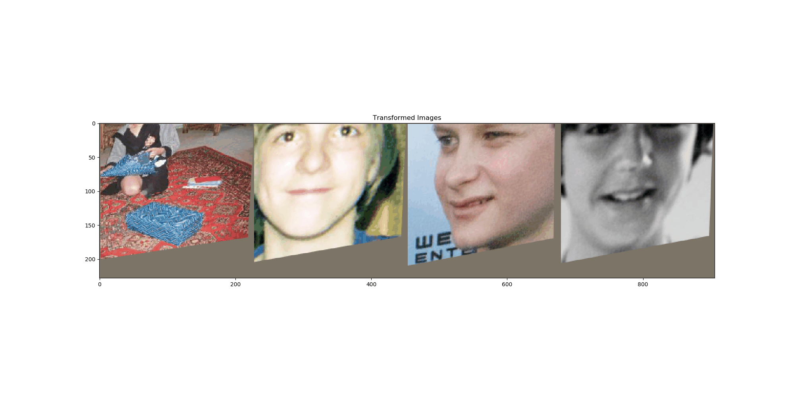
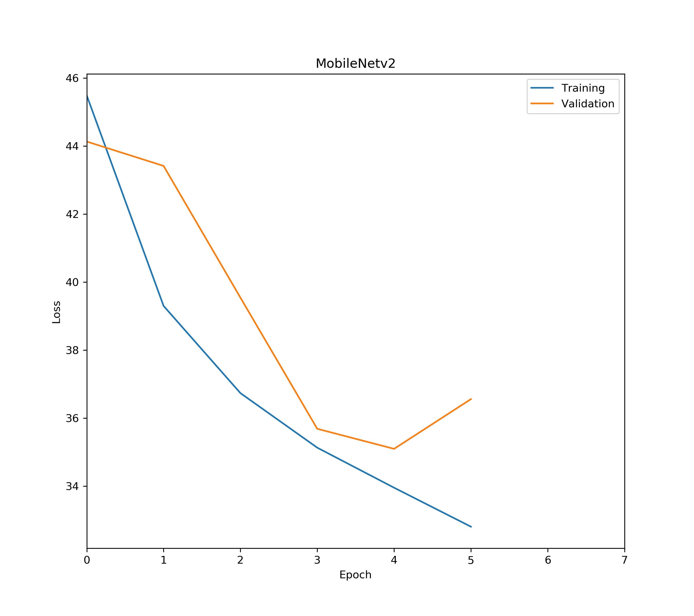

# deep_supervised_spatial_transformer
Deep learning method for face augumentation with unsovable bug

## Getting Started

These instructions will get you a copy of the project up and running on your local machine for development and testing purposes. See deployment for notes on how to deploy the project on a live system.

### Prerequisites

1. Ubuntu
2. Anaconda
3. Cuda
4. Pytorch

### Installing

### Result

